# Nemo Architecture Diagrams

> **Project:** Nemo - Configuration-Driven Application Framework  
> **Created:** February 2026  
> **Location:** `~/Projects/nemo/`

This document contains Mermaid diagrams illustrating Nemo's system architecture at various levels of detail.

---

## 1. System Context Diagram

Shows Nemo's position in relation to external systems and users.

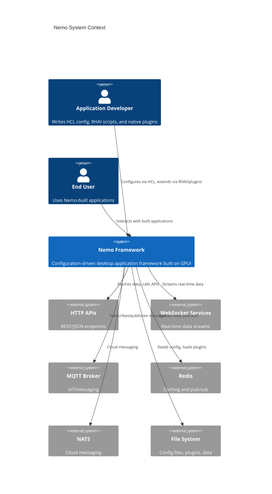

---

## 2. Container Diagram (Crate Structure)

Shows the Rust crate organization and dependencies.

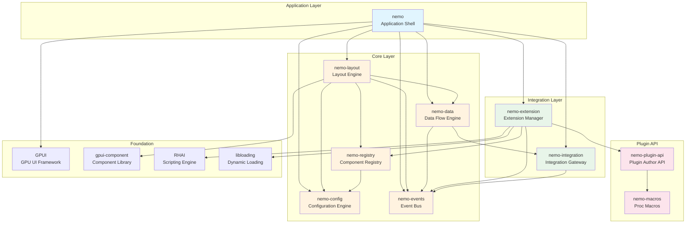

---

## 3. Subsystem Architecture

### 3.1 Configuration Engine

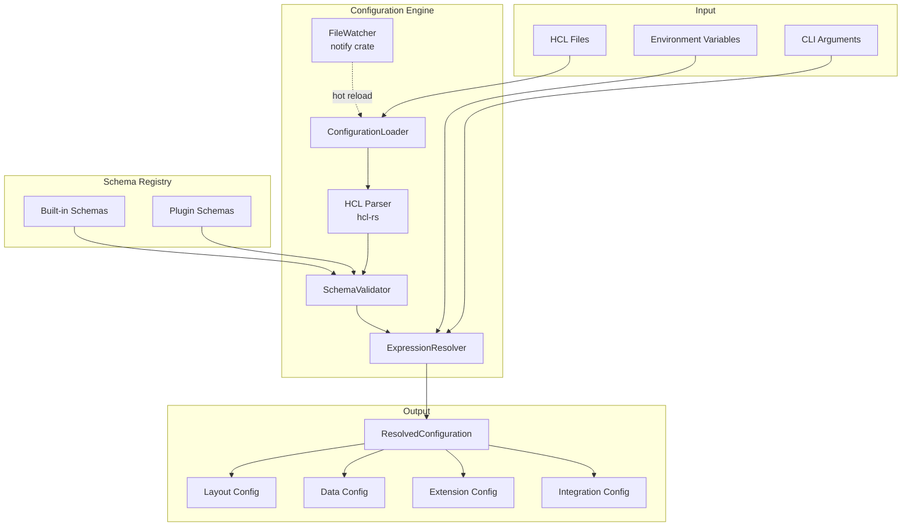

### 3.2 Layout Engine

```mermaid
flowchart TB
    subgraph Input
        layout_cfg[Layout Configuration]
        registry[Component Registry]
        data_bindings[Data Bindings]
    end
    
    subgraph "Layout Engine"
        builder[LayoutBuilder]
        factory[ComponentFactory]
        tree[Component Tree]
        binder[BindingResolver]
        
        builder -->|creates| tree
        factory -->|instantiates| tree
        binder -->|connects| tree
    end
    
    subgraph "GPUI Integration"
        root[NemoRootView]
        render[render() method]
        gpui_tree[GPUI Element Tree]
    end
    
    layout_cfg --> builder
    registry --> factory
    data_bindings --> binder
    
    tree --> root
    root --> render
    render --> gpui_tree
    
    subgraph "Component Types"
        stack[Stack/Flex]
        panel[Panel]
        label[Label]
        button[Button]
        input[Input]
        table[Table]
        custom[Custom Plugin]
    end
    
    factory -.-> stack
    factory -.-> panel
    factory -.-> label
    factory -.-> button
    factory -.-> input
    factory -.-> table
    factory -.-> custom
```

### 3.3 Data Flow Engine

```mermaid
flowchart LR
    subgraph Sources["Data Sources"]
        http[HTTP Polling]
        ws[WebSocket Stream]
        file[File Watcher]
        timer[Timer]
        static[Static Data]
    end
    
    subgraph Transforms["Transformers"]
        map[Map]
        filter[Filter]
        agg[Aggregate]
        join[Join]
        script[RHAI Script]
    end
    
    subgraph Storage["Repositories"]
        memory[In-Memory Store]
        cache[LRU Cache]
    end
    
    subgraph Bindings["Data Bindings"]
        oneway[One-Way Binding]
        twoway[Two-Way Binding]
        computed[Computed Binding]
    end
    
    subgraph Output["Consumers"]
        ui[UI Components]
        actions[Action Triggers]
        events[Event Bus]
    end
    
    Sources --> Transforms
    Transforms --> Storage
    Storage --> Bindings
    Bindings --> Output
```

### 3.4 Event Bus

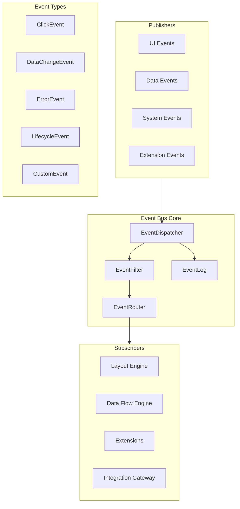

### 3.5 Integration Gateway

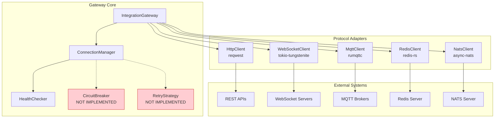

### 3.6 Extension Manager

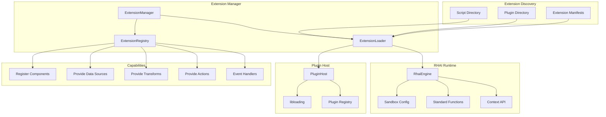

---

## 4. Data Flow Sequence

Shows how data flows from external source to UI update.

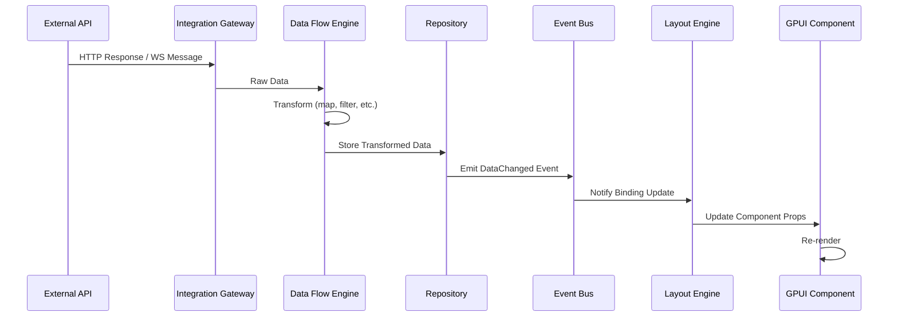

---

## 5. Configuration Loading Sequence

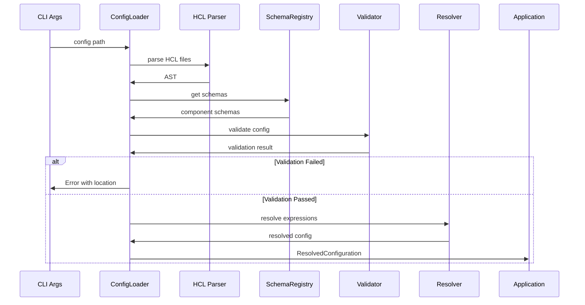

---

## 6. Extension Loading Sequence

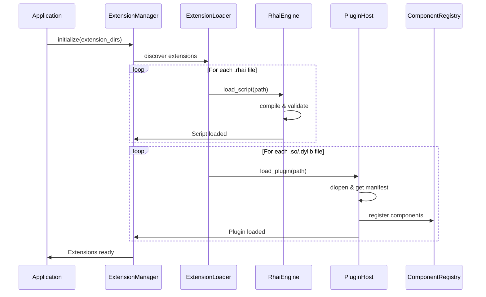

---

## 7. Application Bootstrap Sequence

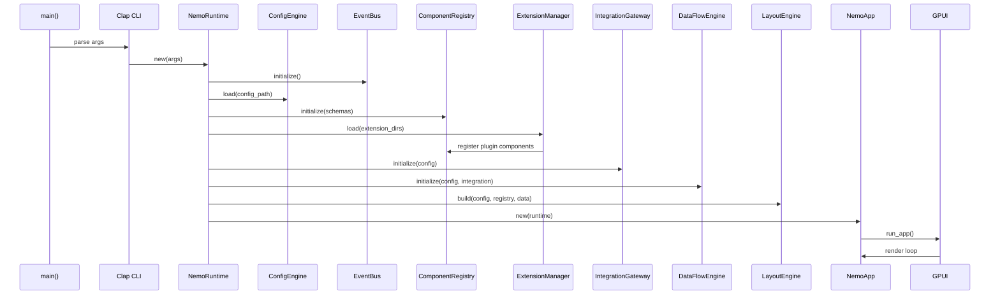

---

## 8. Component Hierarchy (Typical Application)

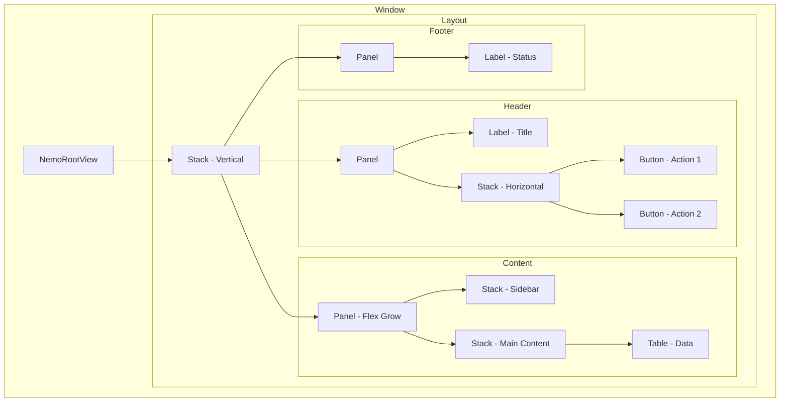

---

## 9. State Management

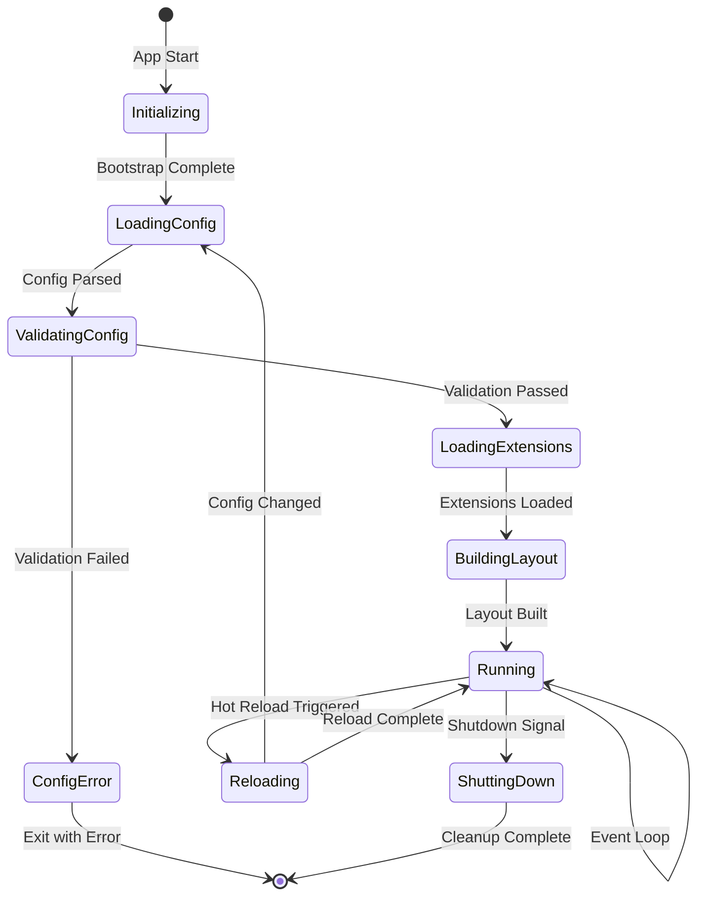

---

## 10. Error Handling Flow

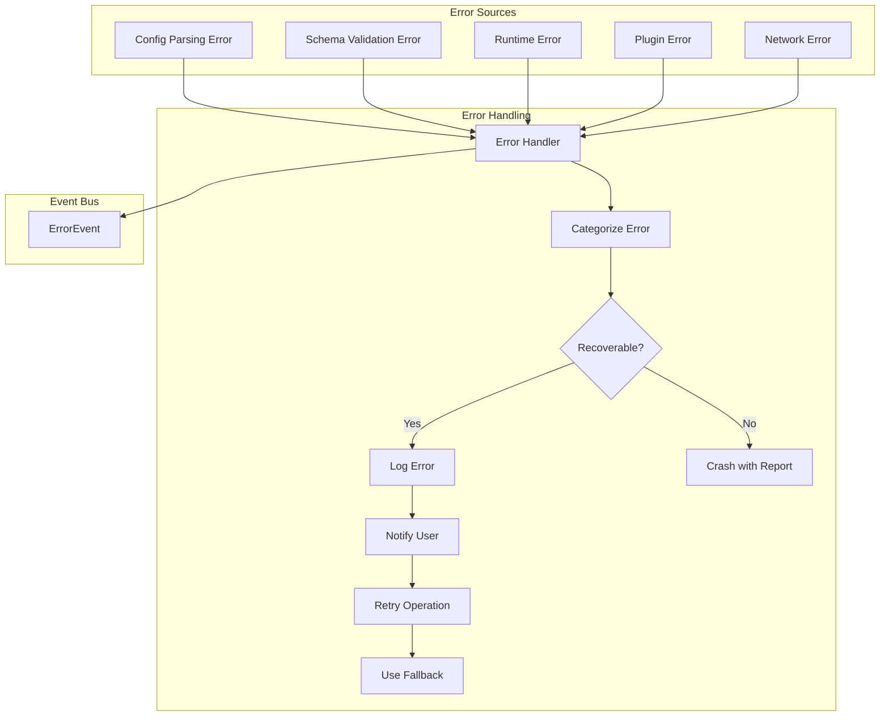

---

## 11. Plugin API Architecture

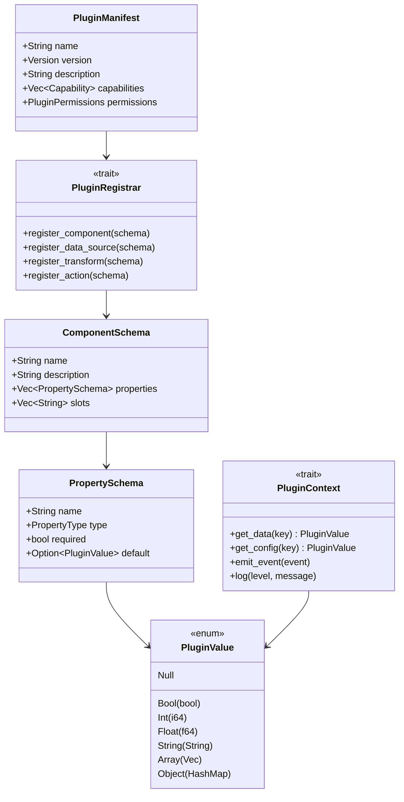

---

## 12. Deployment View

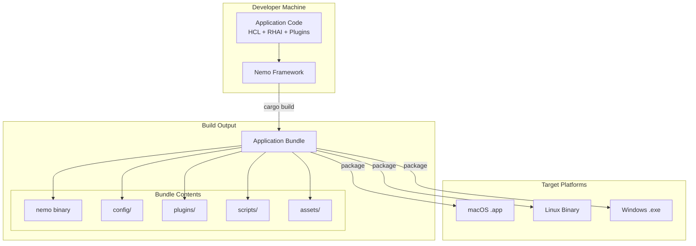

---

## Diagram Legend

| Symbol | Meaning |
|--------|---------|
| Solid arrow (→) | Direct dependency or data flow |
| Dashed arrow (⤍) | Optional or planned feature |
| Red fill | Not implemented / Gap |
| Blue fill | Application layer |
| Orange fill | Core layer |
| Green fill | Integration layer |
| Pink fill | Plugin API layer |

---

## References

- **Code Location:** `~/Projects/nemo/`
- **Architecture Doc:** `docs/planning/nemo-system-architecture.md`
- **Code Review:** `personas/kb/systems-designer/nemo-code-review.md`
- **Subsystem Docs:** `docs/planning/subsystems/`
