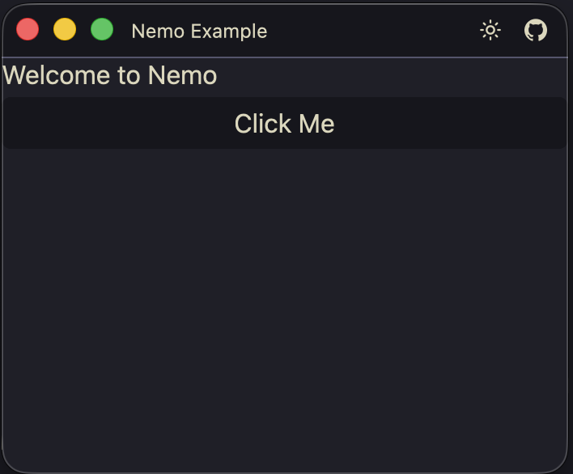

# Basic Example

A minimal Nemo application demonstrating the core structure: a window with a label, a panel, a button, and an HTTP data source.



## Run

```sh
cargo run -- --app-config examples/basic/app.xml
```

## What It Shows

- `app` block with window title, header bar, and theme configuration
- `layout` block with a vertical stack containing a label and a panel
- A button with an `on_click` handler that calls a RHAI function
- An HTTP data source that polls an API endpoint every 30 seconds
- A RHAI script (`scripts/handlers.rhai`) with event handler functions
