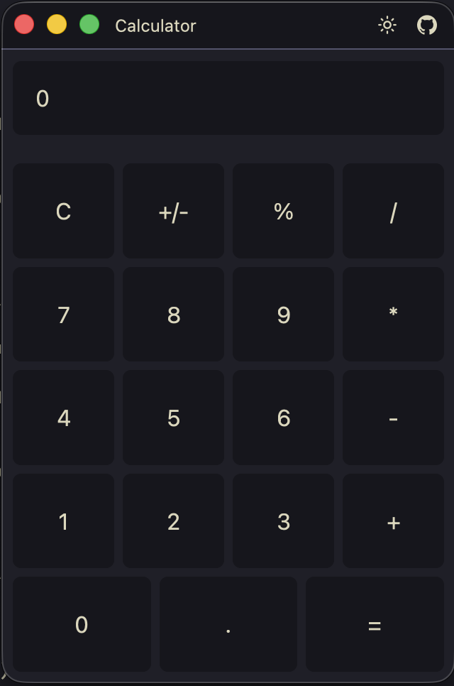

# Calculator Example

A functional calculator built entirely with HCL configuration and RHAI scripting.



## Run

```sh
cargo run -- --config examples/calculator/app.hcl
```

## What It Shows

- Fixed window size with minimum dimensions (`width`, `height`, `min_width`, `min_height`)
- Nested stack layouts using `direction`, `spacing`, and `flex` for a responsive grid of buttons
- Variable interpolation with `${var.button_height}` for consistent sizing
- Shared event handlers -- multiple buttons reference the same handler (e.g., all digit buttons use `on_digit`)
- Component property storage -- calculator state is stored as custom properties on the display label via `get_component_property` / `set_component_property`
- Button variants for visual differentiation between digits, operators, and actions

## RHAI Handlers

The script at `scripts/handlers.rhai` implements:

| Handler | Triggered By | Description |
|---------|-------------|-------------|
| `on_digit` | 0-9 buttons | Appends digit to current input |
| `on_decimal` | `.` button | Adds decimal point |
| `on_operator` | `+` `-` `*` `/` | Stores operand and sets pending operation |
| `on_equals` | `=` button | Evaluates the pending expression |
| `on_clear` | `C` button | Resets all state |
| `on_negate` | `+/-` button | Flips the sign |
| `on_percent` | `%` button | Divides by 100 |
