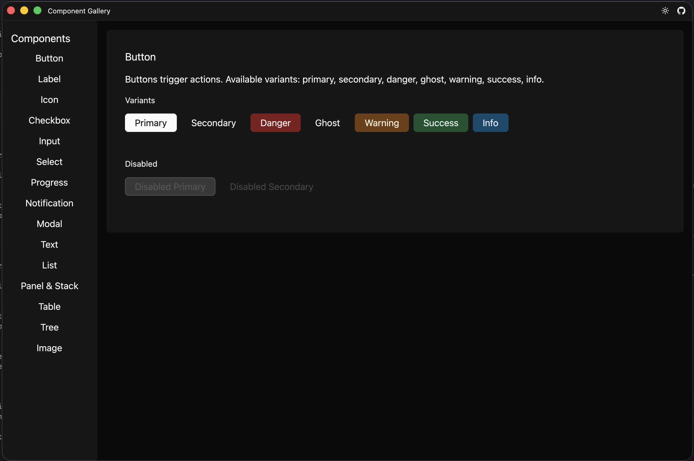

# Component Gallery Example

An interactive showcase of every built-in Nemo component, organized with sidebar navigation.



## Run

```sh
cargo run -- --app-config examples/components/app.hcl
```

## What It Shows

- Sidebar navigation using RHAI to toggle page visibility with `set_component_property`
- Every built-in component type:
    - **Button** -- all variants (`primary`, `secondary`, `danger`, `ghost`, `warning`, `success`, `info`) and disabled state
    - **Label** -- all sizes (`xs`, `sm`, `md`, `lg`, `xl`)
    - **Icon** -- named icons at different sizes
    - **Checkbox** -- checked, unchecked, and disabled states
    - **Input** -- text fields with placeholders and disabled state
    - **Select** -- dropdown with options
    - **Progress** -- progress bars at various values
    - **Notification** -- `info`, `success`, `warning`, `error` kinds
    - **Modal** -- toggled open/closed via a button handler
    - **Text** -- block text content
    - **List** -- vertical item lists
    - **Panel** -- styled containers with border, shadow, and padding
    - **Table** -- tabular data display
    - **Tree** -- hierarchical view
    - **Image** -- image display with alt text
- `visible` property to show/hide component pages without re-rendering
- Modal open/close toggling through `get_component_property` and `set_component_property`
