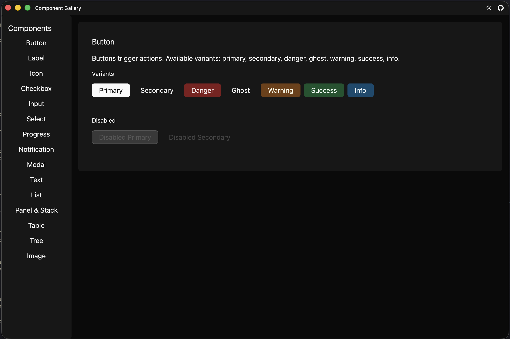

# Component Gallery Example

An interactive showcase of every built-in Nemo component, organized with sidebar navigation.



## Run

```sh
cargo run -- --app-config examples/components/app.nemo
```

## What It Shows

- Sidebar navigation via the chrome-free page router: a `<router>` of `<route>`s
  with a `<nav-link>` per component page — no navigation handler required
- Every built-in component type:
    - **Button** -- all variants (`primary`, `secondary`, `danger`, `ghost`, `warning`, `success`, `info`) and disabled state
    - **Label** -- all sizes (`xs`, `sm`, `md`, `lg`, `xl`)
    - **Icon** -- named icons at different sizes
    - **Checkbox** -- checked, unchecked, and disabled states
    - **Input** -- text fields with placeholders and disabled state
    - **Select** -- dropdown with options
    - **Progress** -- progress bars at various values
    - **Notification** -- `info`, `success`, `warning`, `error` kinds
    - **Modal** -- toggled open/closed via a button handler
    - **Text** -- block text content
    - **List** -- vertical item lists
    - **Panel** -- styled containers with border, shadow, and padding
    - **Table** -- tabular data display
    - **Tree** -- hierarchical view
    - **Image** -- image display with alt text
- The router mounts only the active route's body — pages are unmounted when not
  shown, rather than built-and-hidden
- Jump straight to any page with `--route` (routes mirror the page ids), e.g.
  `nemo dev --route /table examples/components/app.nemo` or
  `nemo screenshot --app-config examples/components/app.nemo --route /charts --out charts.png`
- Modal open/close toggling through `get_component_property` and `set_component_property`
