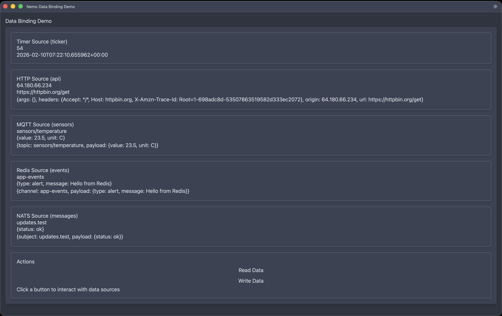

# Data Binding Example

Demonstrates Nemo's data source binding system — HCL-configured data sources that feed live data into UI components through declarative bindings.



## Quick Start (No External Dependencies)

The example works out of the box with the built-in **timer** and **HTTP** data sources:

```sh
cargo run -- --config examples/data-binding/app.hcl
```

- The timer source updates a tick counter every second
- The HTTP source polls httpbin.org every 30 seconds
- Click "Read Data" to read current data via RHAI scripts
- Click "Write Data" to write data and observe binding propagation

## With Docker Services (MQTT, Redis, NATS)

For testing messaging protocol sources, start the Docker services:

```sh
cd examples/data-binding
docker compose up -d
```

Then uncomment the relevant `source` blocks in `app.hcl` and restart.

### Testing MQTT

```sh
# Publish a test message
mosquitto_pub -t sensors/temperature -m '{"value": 23.5, "unit": "C"}'
```

### Testing Redis

```sh
# Publish to a channel
redis-cli PUBLISH app-events '{"type": "alert", "message": "Hello from Redis"}'
```

### Testing NATS

```sh
# Publish a message
nats pub updates.test '{"status": "ok"}'
```

## Mock Data Plugin

Build the mock data plugin for simulated sensor data:

```sh
cargo build -p mock-data-plugin
```

Load it by adding a plugin path to your configuration.

## HCL Configuration Reference

### Data Sources

```hcl
data {
  source "name" {
    type     = "timer"    # timer, http, websocket, mqtt, redis, nats, file
    interval = 1          # source-specific config
  }
}
```

### Bindings

```hcl
component "display" {
  type      = "label"
  bind_text = "data.source_name"           # shorthand one-way binding

  binding {                                 # explicit binding block
    source    = "data.source_name.field"
    target    = "text"
    mode      = "one_way"                   # one_way (default) or two_way
    transform = "payload.temperature"       # field extraction transform
  }
}
```

### Sinks

```hcl
data {
  sink "name" {
    type  = "mqtt"
    topic = "commands"
    host  = "localhost"
    port  = 1883
  }
}
```

### RHAI Script API

```rhai
// Read data from a source
let data = get_data("source_name");

// Write data (triggers binding propagation)
set_data("path.to.data", value);

// Read/write component properties
let text = get_component_text("component_id");
set_component_text("component_id", "new text");
```
